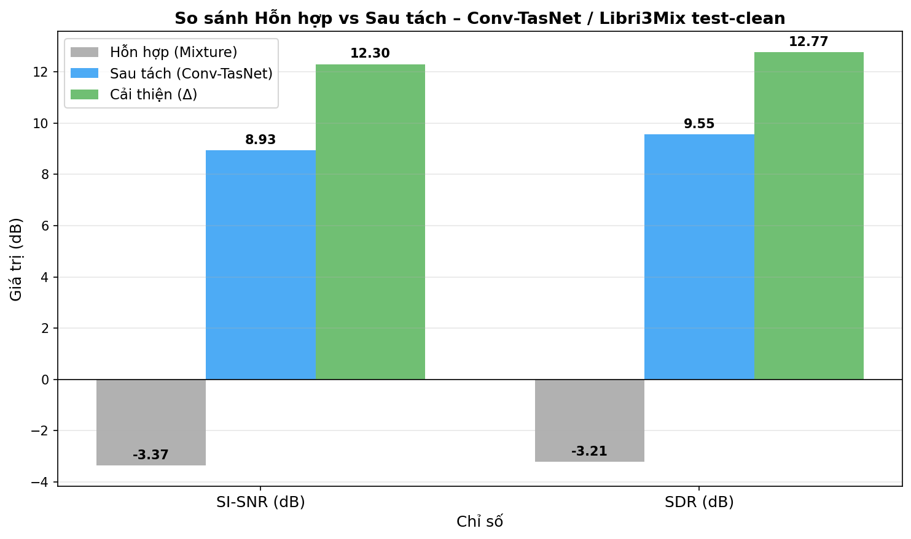
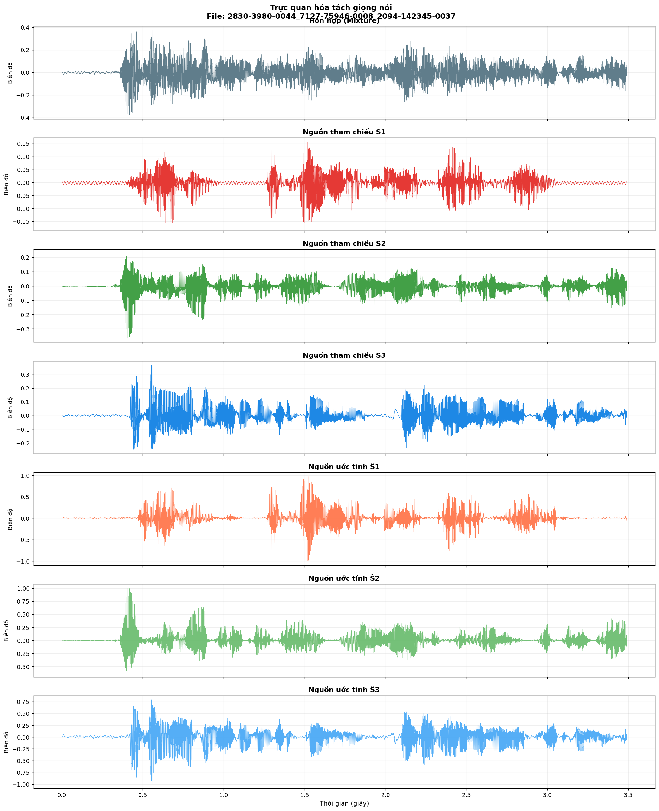

# Conv-TasNet — Tách 3 giọng nói chồng lấn (Speech Separation)

Tách một bản ghi âm có **3 người nói cùng lúc** thành 3 file giọng riêng biệt — bài toán *"cocktail party"* kinh điển của xử lý tiếng nói. Mình **huấn luyện Conv-TasNet from scratch** (khởi tạo ngẫu nhiên, không dùng trọng số pretrained) dựa trên bản cài đặt kiến trúc của [Asteroid](https://github.com/asteroid-team/asteroid); toàn bộ pipeline huấn luyện và đánh giá là mình tự xây. Mô hình đạt **SI-SNRi 12,30 dB** trên 3000 mẫu test độc lập.

   

**Tech stack:** Python · PyTorch · torchaudio · Asteroid · NumPy/Pandas · Matplotlib
**Lĩnh vực:** Deep Learning · Xử lý tín hiệu tiếng nói · Tách nguồn mù (Blind Source Separation)


*Từ một bản trộn ≈ −3,4 dB, model tách ra 3 giọng đạt ≈ +8,9 dB SI-SNR (cải thiện hơn 12 dB).*

## Điểm nổi bật

- **Xây và train từ đầu** một mạng Conv-TasNet để tách **3 nguồn** — khó hơn đáng kể so với bài tách 2 nguồn thường gặp, vì không gian tìm kiếm lớn hơn và phổ tần chồng nhau nhiều hơn.
- **Pipeline trọn vẹn:** chuẩn bị dữ liệu → huấn luyện 200 epoch (có cơ chế train nối tiếp) → đánh giá định lượng trên 3000 mẫu bằng **6 chỉ số** (SI-SNR, SI-SNRi, SDR, SDRi, PESQ, STOI).
- **Kết quả:** SI-SNRi **12,30 dB**, SDRi **12,77 dB**, STOI **0,85**. Khoảng **83%** số mẫu được cải thiện trên 10 dB.
- **Reproduce được:** notebook đánh giá load checkpoint (host trên Kaggle Dataset) và chạy thẳng ra số liệu + biểu đồ, không cần train lại.
- **Có demo nghe trực tiếp:** đưa mixture vào, lấy ra 3 giọng đã tách (xem `assets/audio_samples/`).

## Kết quả

Đánh giá trên **Libri3Mix `sep_clean`, `wav16k/min/test`** — 3000 file, mỗi file 3 người nói. Các chỉ số tính theo hoán vị bất biến (PIT) qua `asteroid.metrics.get_metrics`.

| Chỉ số           | Mean      | Std  |
| ---------------- | --------- | ---- |
| SI-SNR (dB)      | 8,93      | 2,71 |
| **SI-SNRi (dB)** | **12,30** | 2,73 |
| SDR (dB)         | 9,55      | 2,62 |
| **SDRi (dB)**    | **12,77** | 2,65 |
| PESQ             | 1,54      | 0,17 |
| STOI             | 0,85      | 0,05 |

SI-SNRi (mức cải thiện so với đầu vào) là chỉ số chính. Xét phân bố: ~73% số mẫu đạt 10–15 dB, hơn 10% trên 15 dB, chỉ ~2,6% dưới 5 dB (rơi vào các đoạn mà các giọng quá giống nhau về cao độ).

Một mốc để tham chiếu: Conv-TasNet bản gốc tách **2** người (WSJ0-2mix) đạt ~15 dB SI-SNRi. Bài toán **3** người ở đây khó hơn nhiều, nên 12,30 dB là kết quả tốt cho kiến trúc và tác vụ này.


*Hàng trên: bản trộn đầu vào. Giữa: 3 giọng gốc. Dưới: 3 giọng model tách ra.*


## Kiến trúc & cấu hình

Conv-TasNet làm việc thẳng trên miền thời gian: encoder 1-D học cách biểu diễn tín hiệu, khối TCN ước lượng mặt nạ cho từng nguồn, decoder dựng lại từng giọng. Dùng bản cài đặt trong [Asteroid](https://github.com/asteroid-team/asteroid).

| Tham số                              | Giá trị         |     | Huấn luyện | Giá trị           |
| ------------------------------------ | --------------- | --- | ---------- | ----------------- |
| `n_src`                              | 3               |     | Optimizer  | Adam (lr 1e-3)    |
| Sample rate                          | 16 kHz          |     | Loss       | SI-SDR + PIT      |
| `n_filters`                          | 512             |     | Scheduler  | ReduceLROnPlateau |
| kernel / stride                      | 32 / 16         |     | Grad clip  | max-norm 5.0      |
| `bn_chan` / `hid_chan` / `skip_chan` | 128 / 512 / 128 |     | Segment    | 3 giây, batch 4   |
| `n_blocks` × `n_repeats`             | 8 × 3           |     | Epoch      | tối đa 200        |

Val loss thấp nhất là **−9,30 dB**, đạt quanh epoch 191; sau ~epoch 150 thì gần như đi ngang (đã hội tụ).
## Bộ dữ liệu

Dữ liệu **Libri3Mix** (16 kHz, mode `min`, task `sep_clean`) sinh bằng repo gốc [LibriMix](https://github.com/JorisCos/LibriMix). Mỗi split chỉ cần bản trộn `mix_clean` và 3 nguồn `s1`/`s2`/`s3`:

````
Libri3Mix/wav16k/min/
├── train-360/                  # tập huấn luyện (360h)
│   └── mix_clean/ s1/ s2/ s3/
├── dev/                        # tập validation
│   └── mix_clean/ s1/ s2/ s3/
├── test/                       # tập kiểm tra
│   └── mix_clean/ s1/ s2/ s3/
└── metadata/
    ├── mixture_train_mix_clean.csv
    └── mixture_dev_mix_clean.csv
````


## Notebook 

|          | Mô tả                                             | Notebook                                                           |
| -------- | ------------------------------------------------- | ----------------------------------------------------------------- |
| Train    | Conv-TasNet trên Libri3Mix sep_clean (200 epoch)  | [`train_conv_tasnet.ipynb`](notebooks/train_conv_tasnet.ipynb)       |
| Đánh giá | 6 chỉ số + biểu đồ trên 3000 file                 | [`evaluate_conv_tasnet.ipynb`](notebooks/evaluate_conv_tasnet.ipynb) |

## Thử trực tiếp

Tải lên đoạn ghi 3 người nói chồng lấn (16 kHz), model tách ra 3 giọng riêng.

> **Mở app:** https://thuha26012005-demo-separation.hf.space
> Space chạy free nên có thể cần ~1 phút để khởi động nếu đang ở chế độ sleep.
## Hạn chế & hướng phát triển

- Ở các đoạn mà các giọng quá giống nhau (cùng giới, cao độ gần) vẫn còn xuyên âm — PESQ ~1,5 phản ánh điều này.
- Model chạy offline, chưa real-time. Có thể thử biến thể causal cho ứng dụng thời gian thực.
- Hướng tiếp theo: thử các kiến trúc mới hơn (DPRNN, SepFormer), bổ sung dữ liệu có nhiễu/vọng thực tế, và tăng quy mô model.

## Tham khảo

```bibtex
@article{luo2019conv,
  title   = {Conv-TasNet: Surpassing Ideal Time-Frequency Magnitude Masking for Speech Separation},
  author  = {Luo, Yi and Mesgarani, Nima},
  journal = {IEEE/ACM Transactions on Audio, Speech, and Language Processing},
  year    = {2019}
}
```

Cảm ơn [Asteroid](https://github.com/asteroid-team/asteroid) và [LibriMix](https://github.com/JorisCos/LibriMix).

## License

[MIT](LICENSE)
